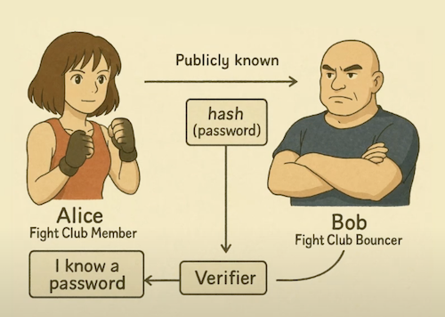

# Noir ZK Proof Demo

From [Build Your First ZK App with Noir](https://www.youtube.com/watch?v=06INZUM5Ca8) 

## Installation

```bash
curl -L https://raw.githubusercontent.com/noir-lang/noirup/refs/heads/main/install | bash
curl -L https://raw.githubusercontent.com/AztecProtocol/aztec-packages/refs/heads/master/barretenberg/bbup/install | bash
noirup
bbup
```

## Sanity Check

```bash
nargo --version
bb --version
```

Yields:

```
nargo version = 1.0.0-beta.3
noirc version = 1.0.0-beta.3+ceaa1986628197bd1170147f6a07f0f98d21030a
(git version hash: ceaa1986628197bd1170147f6a07f0f98d21030a, is dirty: false)
v0.82.2
```

## Setup

```
mkdir noir-zk-proof-demo
cd noir-zk-proof-demo
nargo init --name workshop
nargo test --show-output
```

## Build a Witness

In this scenario Alice wants to proof to Bob ('the bouncer') that she knows the correct password to enter the fight club. However, she does not want Bob to know the password becasue he is not a member of the club (he is just employed as a bouncer and is not allowed in).



To recap:

* Alice knows the password
* Bob knows the password hash

Generate an empty placeholder `Prover.toml` by running: ``

```bash
nargo check
```

The placeholder looks like this:

```toml
password = ["", "", ""]
password_hash = ""
```

This needs to be completed by Alice with the correct `password` and `password_hash`. Obviously this needs to remain private and would not be shared or committed into Github!

Now Alice can generate a witness that she knows the password by running:

```bash
nargo execute
```

This generates two files in the `/target` directory. 

- `workshop.json` is similar to an ABI file that is generated when compiling a Solidity contract. This is sometimes refered to as the binary.
- `workshop.gz` is the witness file which is the solution to the circuit that we can use to later genearate a proof for Alices claim that she knows the password. 

However, its not possible to simly provide the witness file to the validator (Bob) as that does not prove that Alice knows the password. What we need to do is generate a proof! 

## Build a Proof

We use barretenberg (`bb`) to build a proof using the witness `workshop.gz`. You can consider the witness to be the compiled circit and the proof actually prooves the witness compleed the circut using the correct preimage password.

```bash
bb prove -w target/workshop.gz -b target/workshop.json -o target
```

This will use the barretenberg service to generate a proof that the witness really completed the circit and know the preimage of the hash.

The proof file will be saved in `target/proof`. It is unreadable but you can use the following command to read it:

```bash
cat ./target/proof | od -An -v -t x1 | tr -d $' \n' | sed 's/^.\{8\}//'
```

NOTE: The plain text, preimage password string is NOT in the proof file at all! However you should see the first part of the proof are the public inputs (the `password_hash`).

```
23864adb160dddf590f1d3303683ebcb914f828e2635f6e85a32f0a1aecd3dd800000000000000000000000000000016a29678b012b7df7ce728ea782aa9667300000000000000000000000000000000001afdc6cdff233901cc7bf865269ccb000000000000000000000000000000f .....<snip>
```
 
As you can see the beginning of the proof is `23864adb160dddf590f1d3303683ebcb914f828e2635f6e85a32f0a1aecd3dd8` which is the `password_hash`!

## Verify the Proof

Now we put ourselves in the shoes of Bob. He is the bouncer and Alice has provided him with the `target/proof` file. Bob also has the circit program `src/main.nr` and the public inputs `password_hash` value. However, Bob does NOT know the `password` and (at this point) does not know if the proof is valid.

So now Bob needs to verify the proof!

First lets just assume that Bob only has the `src/main.nr` file in the project. First he can compile like so:

```bash
nargo compile
```

How can Bob be certain that he is compiling the same circit that Alice compiled? This is where `bb` can be used again:

```bash
bb write_vk -b target/workshop.json -o target
```

This generates a verification key `target/vk` which Bob can use together with the `target/proof` to correctly validate the proof was generated using the circuit that he compiled. 

```bash
bb verify
```

The output should be:

```
Scheme is: ultra_honk
Proof verified successfully
```

Meaning the proof is valid for completing the specified circuit.

## Summary

Alice Generates Proof

1. Build the circuit logic in Noir using `nargo init --name workshop` and code `main.nr`
2. Generate the `Prover.toml` file using `nargo check` and set the public and private fields.
3. Generate the witness file using `nargo execute`
4. Generate the proof using `bb prove -w target/workshop.gz -b target/workshop.json -o target`
5. Send the circuit code `main.nr` and the `proof` file to Bob

Bob Validates Proof

1. Compile the circuit `nargo compile`
2. Generate the verification key `bb write_vk -b target/workshop.json -o target` 
3. Verify the proof `bb verify` 

## Deploy